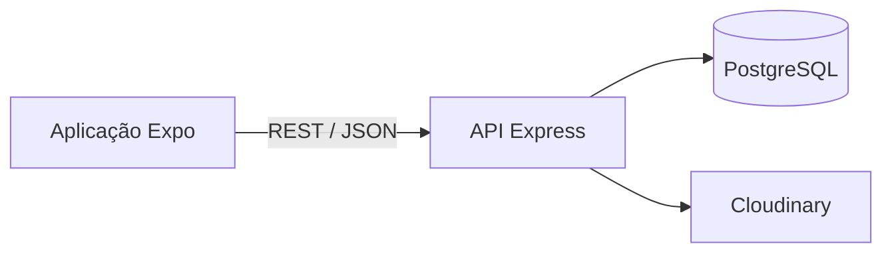

# FarmaBusca

> Aplicação mobile que aproxima pacientes e farmácias, facilitando a pesquisa de medicamentos e a gestão da sua disponibilidade.


## Sobre o projeto

O **FarmaBusca** é um sistema full-stack criado para ajudar pacientes a encontrar medicamentos e farmácias. A solução também permite que as farmácias submetam documentos para aprovação e façam a gestão do seu catálogo.

O projeto nasceu de um problema prático: a dificuldade de saber rapidamente onde um medicamento está disponível.

## Funcionalidades implementadas

- Registo e autenticação com JWT.
- Perfis de **Paciente**, **Farmácia** e **Administrador**.
- Pesquisa e listagem de medicamentos e farmácias.
- Favoritos para pacientes autenticados.
- Cadastro de farmácias em duas etapas.
- Upload de imagens e documentos através do Cloudinary.
- Aprovação de farmácias por um administrador.
- Gestão de medicamentos com controlo de permissões por farmácia.
- Documentação básica da API com Swagger.

## Arquitetura



| Camada | Tecnologias |
|---|---|
| Mobile | React Native, Expo, React Navigation, Axios |
| Backend | Node.js, Express, JWT, Express Validator |
| Dados | PostgreSQL, Sequelize |
| Ficheiros | Multer, Cloudinary |

## Estrutura do repositório

```text
farmabusca/
├── farmabusca-backend/    # API REST e acesso à base de dados
├── farmabusca-frontend/   # Aplicação React Native/Expo
└── README.md
```

## Executar localmente

### 1. Backend

Crie um ficheiro `.env` em `farmabusca-backend/` com as variáveis necessárias:

```env
PORT=5000
DB_HOST=localhost
DB_PORT=5432
DB_NAME=farmabusca
DB_USER=postgres
DB_PASSWORD=altere_esta_senha
DB_SSL=false
JWT_SECRET=altere_esta_chave
CLOUDINARY_CLOUD_NAME=seu_cloud_name
CLOUDINARY_API_KEY=sua_api_key
CLOUDINARY_API_SECRET=sua_api_secret
```

Depois execute:

```bash
cd farmabusca-backend
npm install
npm run dev
```

A documentação Swagger fica disponível em `http://localhost:5000/api-docs`.

### 2. Aplicação mobile

```bash
cd farmabusca-frontend
npm install
npx expo start -c
```

Configure o endereço da API em `app.json` antes de testar num dispositivo físico.

## Próximos passos

- Adicionar testes automatizados para os fluxos críticos.
- Concluir testes ponta a ponta do cadastro e aprovação de farmácias.
- Melhorar validações e mensagens de erro nos uploads.
- Criar relatórios agregados sobre disponibilidade de medicamentos.

## Autor

Desenvolvido por [Rosário Pompilio Caravela](https://github.com/rosariocaravela), estudante de Engenharia Informática em Maputo, Moçambique.

